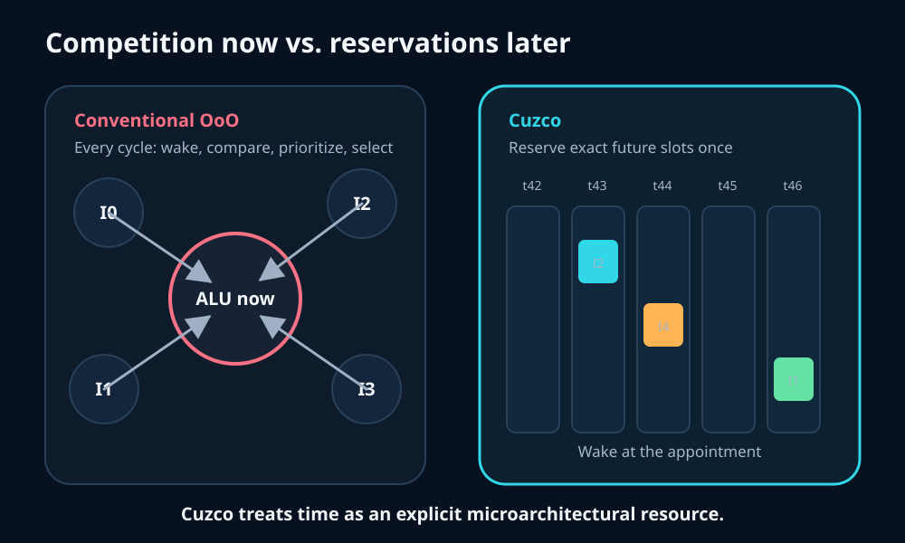
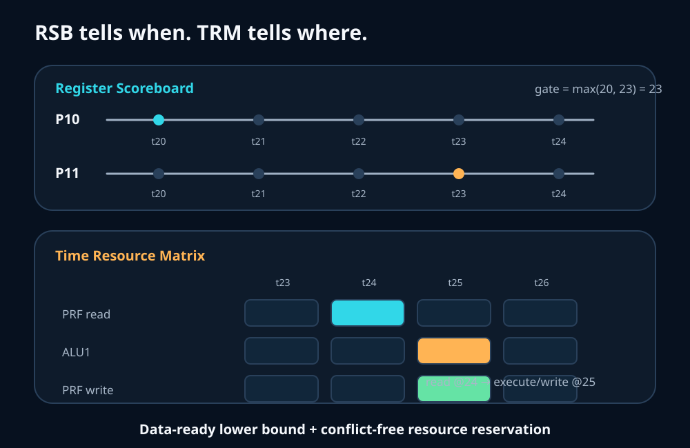
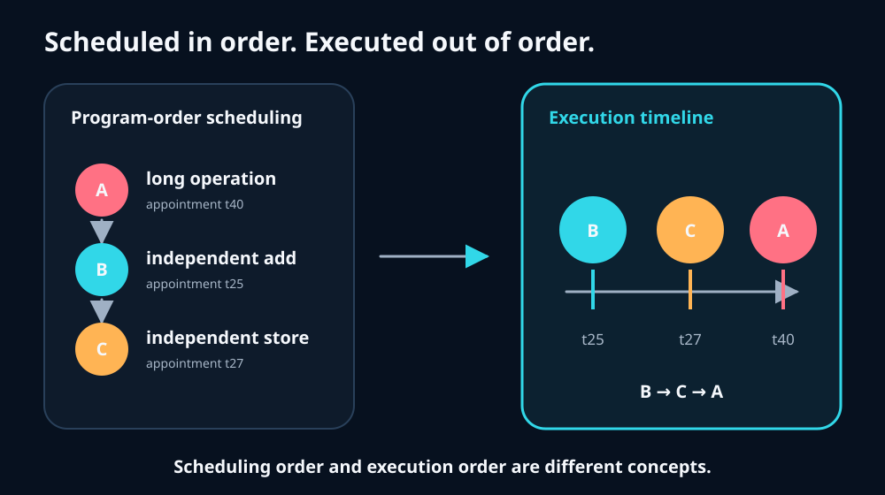
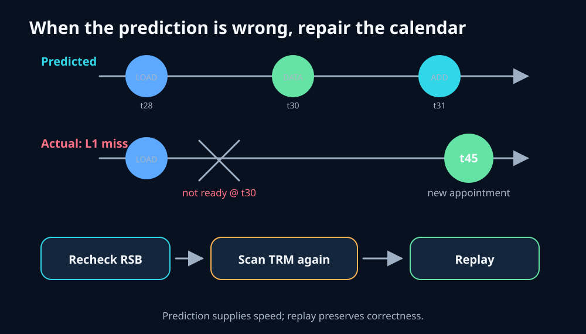
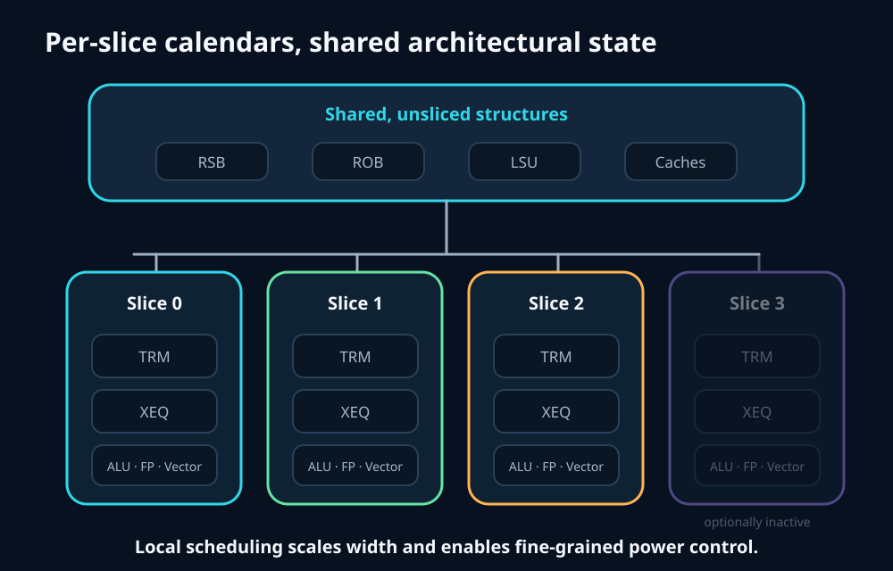
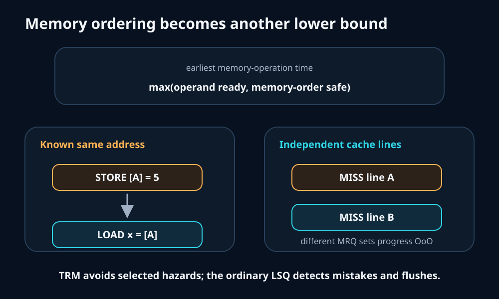
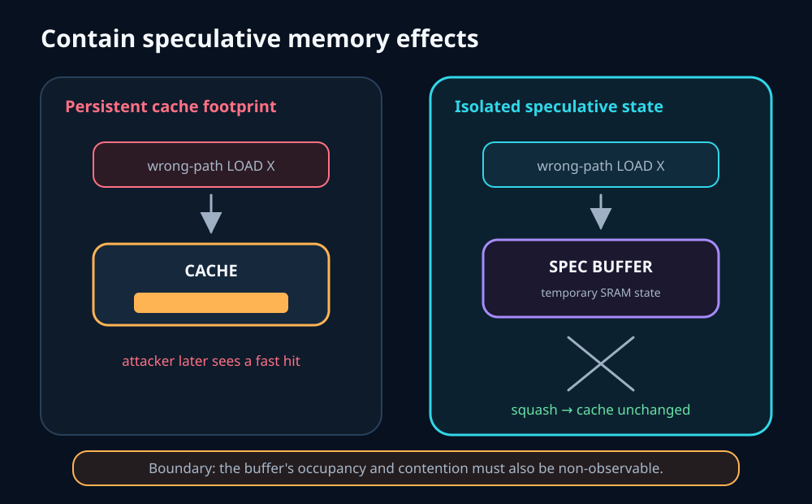
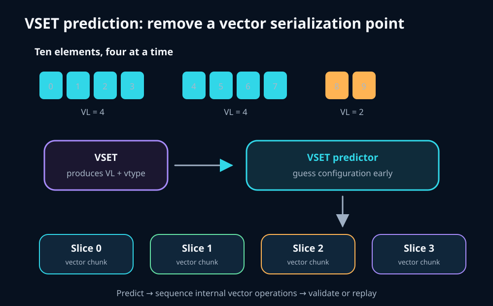

# Cuzco: scheduling the future in a RISC-V core

Cuzco is a high-performance, RVA23-compatible RISC-V processor IP from Condor Computing, an Andes Technology company. I began reading the paper expecting the familiar ingredients of a modern wide out-of-order core: a large reorder buffer, aggressive branch prediction, vector execution, and a deep cache hierarchy.

The surprising part was the scheduler.

A conventional out-of-order scheduler repeatedly asks, **“Which waiting instructions are ready now?”** Cuzco instead tries to answer, **“In which future cycle should each instruction execute?”**

That change—from continuous competition to future reservations—is the central idea of this study.



*Conventional scheduling repeatedly selects winners. Cuzco gives instructions future appointments.*

## Beginner vocabulary

Before examining the design, these terms are useful:

| Term | Beginner-friendly meaning |
| --- | --- |
| **RISC-V** | An instruction set architecture: the software-visible contract implemented by a processor. |
| **RVA23** | A standardized RISC-V profile for 64-bit application processors. |
| **Out-of-order (OoO)** | The processor may execute independent instructions in a different order from the program while preserving the program's visible result. |
| **ROB** | Reorder buffer. It tracks in-flight instructions and makes their results architecturally visible in order. |
| **PRF** | Physical register file. Renamed instructions read and write physical registers here. |
| **LSU** | Load/store unit. It executes memory operations and enforces memory-ordering rules. |
| **RSB** | Cuzco's register scoreboard. It records when physical-register values are expected to become available. |
| **TRM** | Time Resource Matrix. It records which future cycles have free read ports, execution resources, and writeback ports. |
| **XEQ** | An execution queue that holds an instruction until its reserved execution time. |

## Why instruction scheduling is difficult

A large out-of-order core can have hundreds of in-flight instructions. A conventional scheduler holds waiting instructions in issue queues and repeatedly performs several operations:

1. Compare source tags against newly produced results.
2. Wake instructions whose operands have become ready.
3. Determine which execution units and ports are available.
4. Prioritize ready instructions, often favoring older work.
5. Select the limited number that can issue this cycle.

Doing this in one clock cycle becomes physically difficult as the window and issue width grow. More entries and more execution choices create more comparisons, result-broadcast paths, and global wires. Distributed queues reduce some timing pressure, but they also weaken global age ordering and can require more total entries.

The important constraint is not the arithmetic operation itself. It is connectivity.

## The central idea: schedule by time

Cuzco borrows the spirit of compiler scheduling but performs it in hardware with runtime information. During decode and scheduling, it predicts when operands will be ready and books the resources required by the instruction.

For an add, the reservation might look like:

```text
cycle 24: read two source registers
cycle 25: execute on ALU1
cycle 25: forward and write the result
```

The instruction then waits in an XEQ for its timestamp. At cycle 24 or 25, it does not compete against every other waiting instruction for the same resources: the necessary slots were already reserved.

### Register Scoreboard: when will the data exist?

Suppose an instruction consumes two physical registers:

```text
P10 expected ready at cycle 20
P11 expected ready at cycle 23
```

The earliest time at which both operands can be consumed is the later time:

```text
operand gate = max(20, 23) = cycle 23
```

The unsliced RSB stores these expected write times. When a producer is scheduled, its destination's future time is recorded so younger consumers can be scheduled immediately.

### Time Resource Matrix: where is there room?

Starting at the operand gate, the selected slice's TRM searches for the earliest future placement where all required resources are free:

* PRF read ports,
* the correct execution pipeline,
* forwarding paths where modeled, and
* a PRF write port.



*The RSB provides the data-ready lower bound; the TRM finds and reserves a conflict-free pipeline placement.*

This is the paper's most important mechanism. Instead of maintaining a large continuously searched set of “possibly ready” instructions, Cuzco precomputes a speculative calendar for a window of future cycles.

## Scheduled in order, executed out of order

The paper says TRM scheduling is performed in program order. That does **not** make Cuzco an in-order processor.

Consider three instructions:

```text
A: long-latency operation  → appointment at cycle 40
B: independent add        → appointment at cycle 25
C: independent store      → appointment at cycle 27
```

The scheduler examines A, B, and C in program order, but their appointments produce the execution order B, C, A.



*Scheduling order and execution order are separate ideas.*

Cuzco constructs an out-of-order future while instructions pass through the scheduling stages.

## The future is uncertain: prediction and replay

The schedule is optimistic. Loads are scheduled using a predicted cache level and predicted latency. A common assumption is that a load will hit in the expected cache without an extra bank conflict or other delay.

Suppose a load is expected to produce data at cycle 30, and an add is reserved to consume it then. If the load misses, the add reaches its appointment without valid data.

Cuzco repairs the plan:

1. Recheck the source operands through the RSB.
2. Obtain updated expected write times.
3. Search the TRM again.
4. Reserve a later placement.
5. Replay the instruction.

Dependent instructions can also require rescheduling, and an instruction can be replayed more than once.



*Cuzco does not need a perfect future. It needs normal cases to be predictable enough that repairing exceptions is worthwhile.*

### Load latency prediction is not load–store dependence prediction

The paper explicitly discusses predicting **when a load will return**, including future prefetch-informed load-latency prediction.

It does not describe a dedicated Cuzco load–store dependence predictor such as a store-set table, PC-indexed predictor, confidence counters, or a training policy. The background section mentions reactive memory-dependence predictors as prior work, but the implementation details for generating Cuzco's memory-order scheduling bound are not disclosed.

Speculation alone does not prove that a learned predictor exists. A processor can use a fixed policy such as allowing a load to pass an older unresolved store and then flush if the assumption was wrong.

## Sliced execution

Cuzco divides much of the backend into symmetric execution slices. Each slice has:

* a TRM,
* execution queues, and
* integer, floating-point, branch, load/store-pipeline, and vector resources.

Other structures remain shared, including the RSB, ROB, LSU, memory-management resources, and caches.



*Per-slice calendars localize scheduling. Shared structures maintain a common architectural and memory-ordering view.*

Slicing is not new by itself. Cuzco's interesting combination is that a separate TRM per slice lets scheduling width scale without recreating one giant global wakeup-and-select network. Slices can also support fine-grained power management: inactive slices can be disabled when the workload does not need the full machine width.

## Memory ordering: mostly conventional machinery, differently integrated

Cuzco uses familiar load and store queues allocated in program order. The LSU checks address relationships, preserves correct memory behavior, and initiates a flush when speculative execution violates program semantics.

The distinct time-based addition is that memory ordering can become another lower bound in the appointment calculation:

```text
earliest memory-operation time =
    max(operand-ready time, memory-order-safe time)
```



*Known or selected ordering constraints can delay an appointment; ordinary LSQ checks remain the correctness backstop.*

If two addresses are known to be different, the younger load does not need to wait. If an older store's address is unresolved, the processor must choose between waiting conservatively and speculating that the accesses do not alias. The paper establishes that violations are detected and flushed, but does not fully document the selection policy.

### What is the MRQ?

When an L1 access misses, Cuzco tracks it in a Memory Request Queue (MRQ). The implemented design preserves ordering within an MRQ set, associated with a cache line, while allowing different sets to progress out of order.

That avoids head-of-line blocking: a slow request for line A need not prevent an independent request for line B from completing.

The MRQ name and organization are implementation details, not a fundamentally new class of structure. Conventional cores already have structures such as MSHRs, line-fill buffers, and load-miss queues.

## The speculative SRAM buffer and security boundary

The paper says Cuzco holds speculative memory operations in an SRAM-based buffer until they pass the relevant speculation point. The intended effect is to prevent a wrong-path operation from leaving a persistent footprint in the normal cache.



*If a wrong-path entry is discarded before it changes the cache, a later attacker cannot recover that secret through the same cache footprint.*

“SRAM” only describes the storage technology. Security depends on the buffer's visibility and sharing policy. A finite speculative buffer could itself leak information if secret-dependent occupancy, conflicts, hits, or stalls are observable. The paragraph does not provide enough detail to establish protection against every timing channel.

The paper carefully claims protection against **several types** of attacks, not universal side-channel immunity. Similar shadow-state principles appear in earlier research such as SafeSpec and InvisiSpec; the notable point here is their inclusion in Cuzco's design.

## Vector execution for a beginner

A scalar instruction usually operates on one value. A vector instruction applies the same operation to several elements:

```text
[10, 20, 30, 40] + [1, 2, 3, 4]
                    =
[11, 22, 33, 44]
```

The RISC-V Vector Extension (RVV) provides vector registers and instructions.

* **VLEN** is the physical width of an architectural vector register.
* **VL** is the number of elements currently active.
* **vtype** describes the element width, register grouping, and tail/mask policy.
* **VSET** is the family of instructions that establishes VL and vtype.
* **vsetivli** requests the element count and type using immediate fields.
* **vsetvli** can obtain the requested count from a scalar register, which is useful for a loop's remaining element count.

For ten elements on a machine processing four at once, a strip-mined loop uses active lengths 4, 4, and 2.

Every following vector instruction implicitly depends on the VL and vtype produced by VSET. Cuzco must also break an architectural vector instruction into internal vector operations and distribute them across slices. Waiting for VSET creates a serialization point.

Cuzco therefore adds a dedicated VSET predictor. It predicts the next VL and vtype, begins sequencing vector work, and validates the prediction when VSET resolves.



*VSET prediction follows the same Cuzco philosophy: predict future state, schedule early, and repair a mistake.*

## The performance tradeoff

The paper compares time-based scheduling with an optimistic greedy scheduler model. The modeled greedy scheduler issues waiting instructions as soon as operands are available while ignoring practical PRF-port and result-bus limitations. Against that idealized comparison, the current time-based design has about a 5% average performance impact on the reported SPEC integer studies.

The reason the result is still interesting is the exchange:

```text
small modeled performance cost
              ↕
less continuous checking,
simpler wiring and timing,
lower scheduling power,
and easier width scaling
```

The paper also reports estimated unvectorized SPEC CPU 2006 and 2017 integer performance above 17.5/GHz and 2.1/GHz respectively for its baseline eight-wide model.

These are design-correlated, trace-driven, cycle-accurate simulation results—not measurements from production silicon.

## What is genuinely distinctive?

| Mechanism | Assessment |
| --- | --- |
| Runtime compiler-inspired scheduling using future timestamps | Central Cuzco innovation |
| RSB plus per-slice TRMs reserving complete future pipeline placements | Central Cuzco mechanism |
| Selecting timestamped work instead of continuously searching all waiting instructions | Central scaling argument |
| Replay as repair for an optimistic precomputed schedule | Important part of the Cuzco combination |
| Per-slice calendars combined with scalable execution slices | Distinctive system-level integration |
| Memory ordering as another scheduling-time lower bound | Clever extension of the time-based model |
| Dedicated VSET prediction | Notable vector-specific feature |
| ROB, register renaming, LSQ disambiguation, and violation flushes | Conventional OoO mechanisms |
| MRQ/MSHR-like miss tracking | Familiar concept with a Cuzco-specific organization |
| Speculative shadow buffering | Not new as a general research concept; implementation details may be distinctive |

The novelty is not that Cuzco predicts loads, replays instructions, or uses queues. Modern cores already do those things. The deeper departure is using **future operand and resource reservations as the normal scheduling substrate**.

## Takeaway

Traditional out-of-order processors continuously discover what can execute now. Cuzco tries to construct the future execution schedule in advance and uses replay when that future changes.

That reframes time as a first-class microarchitectural resource.

Whether this becomes a widely adopted scheduling style remains to be seen. The paper nevertheless demonstrates that a high-performance general-purpose core can be organized more like a runtime hardware compiler with a calendar.

## References

1. S. Nemawarkar *et al.*, “Cuzco: A High-Performance RISC-V RVA23-Compatible CPU IP,” *IEEE Micro*, July/August 2026. [doi:10.1109/MM.2026.3708530](https://doi.org/10.1109/MM.2026.3708530).
2. RISC-V International, [RVA23 Profile](https://docs.riscv.org/reference/rva23/index.html).
3. RISC-V International, [“V” Standard Extension for Vector Operations](https://docs.riscv.org/reference/isa/unpriv/v-st-ext.html).
4. K. N. Khasawneh *et al.*, [“SafeSpec: Banishing the Spectre of a Meltdown with Leakage-Free Speculation”](https://www.cs.ucr.edu/~csong/dac19-safespec.pdf), DAC 2019.
5. M. Yan *et al.*, [“InvisiSpec: Making Speculative Execution Invisible in the Cache Hierarchy”](https://cwfletcher.github.io/content/research/2018.micro.invisispec.paper.pdf), MICRO 2018.
